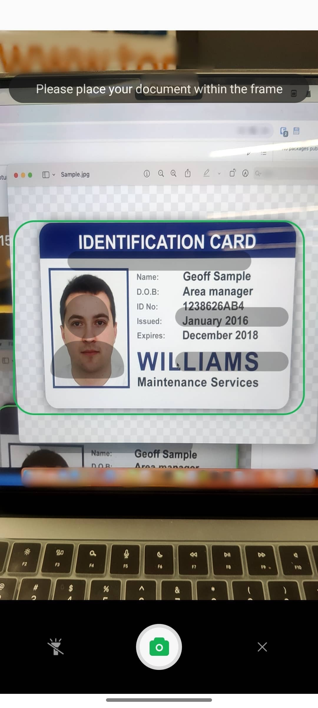
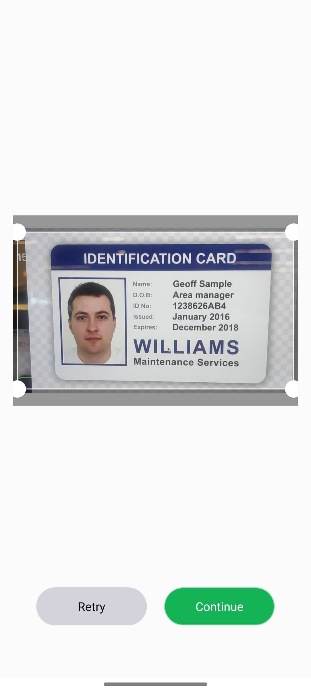
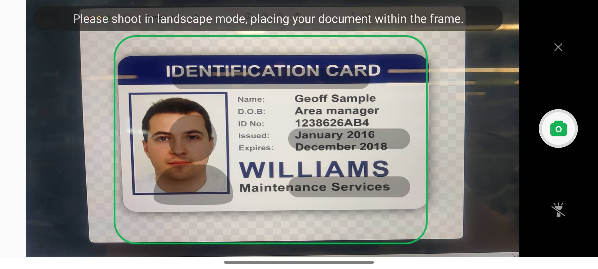
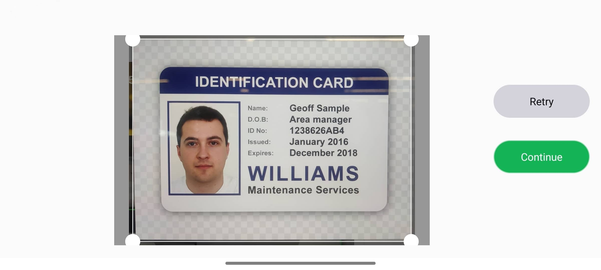

# 简介

TDOcrDocCapture 是为客户提供一个证件拍摄的UI库，以源码形式提供，同时支持iOS 和 Android，本仓库为Android 仓库

### 竖屏

| 拍照页面 | 裁剪页面 |
| -------- | -------- |
|   |   |

### 横屏

| 拍照页面 | 裁剪页面 |
| -------- | -------- |
|    |   |

# 集成

1.将 TDOcrDocCapture-Android/TDOcrDocCapture 文件夹下 tdocrdoccapture 导入您的Android Studio 工程；

2.在需要的地方调用

2.1.在 app/build.gradel 中引入依赖

```
dependencies {
    implementation project(':tdocrdoccapture')
    ...
}
```

2.2.调用

```
//带人脸头像的证件拍摄
TDIDCardCamera.create(MainActivity.this).openCamera(TDIDCardCamera.TYPE_IDCARD_NO_FACE_TIPS, TDIDCardCamera.SCREEN_FORCE_LANDSCAPE);

//不带人脸头像的证件拍摄
TDIDCardCamera.create(MainActivity.this).openCamera(TDIDCardCamera.TYPE_IDCARD_FACE_TIPS, TDIDCardCamera.SCREEN_AUTOMATIC_ROTATION);
```

2.3. 获取结果

```java
@Override
protected void onActivityResult(int requestCode, int resultCode, Intent data) {
    super.onActivityResult(requestCode, resultCode, data);
    if (resultCode == TDIDCardCamera.RESULT_CODE) {
        //Get the image path and display the image
        final String path = TDIDCardCamera.getImagePath(data);
        if (!TextUtils.isEmpty(path)) {
            Bitmap bitmap = BitmapFactory.decodeFile(path);
            mIvIDCardResult.setImageBitmap(bitmap);

            // 上传图片的base64
               String imageBase64 = ImageUtils.getBase64FromImagePath(path);

            // 在实际开发中，成功将镜像上传到服务器后，需要删除所有缓存的镜像。只需调用以下方法:
            // FileUtils.clearCache(this);
        }
    }
}
```


# 配置项

## 1.实际裁剪相对裁剪框尺寸的放大比例
文件路径: com/trustdecision/tdocrdoccapture/camera/TDCameraActivity.java

```
private void cropImage(Bitmap bitmap) {
    ...
    // 放大比例
    float expansion = 0.05f; // 5%
    leftProportion = Math.max(0, leftProportion - expansion);
    rightProportion = Math.min(1, rightProportion + expansion );
    topProportion = Math.max(0, topProportion - expansion / 3);      
    bottomProportion = Math.min(1, bottomProportion + expansion / 3);
    ...
}
```


## 2.裁剪后证件图片的期望大小

文件路径: com/trustdecision/tdocrdoccapture/camera/TDCameraActivity.java

默认是300Kb，可修改为你期望的大小

```
private void confirm(Bitmap bitmap) {
    ...
    mCropImageView.crop(new CropListener() {
        @Override
        public void onFinish(Bitmap bitmap) {
            ...
            //压缩图片, 默认最大500px高度, 不超过300kb
            bitmap =  ImageUtils.compressBitmapByHeight(bitmap, 500 ,300);
            ...
        }
    }, true);// true: 拉伸拓展图片, false 不拉伸拓展图片
...
}
```

## 3.是否显示手动裁剪点

文件路径: com/trustdecision/tdocrdoccapture/camera/TDCameraActivity.java

```
private void cropImage(Bitmap bitmap) {
    ...
    /**
     *
     * @param showClipPoint true: 默认显示裁剪点, false: 不显示裁剪点
     **/
    mCropImageView.setImageBitmap(mCropBitmap, true);
    ...
}
```

